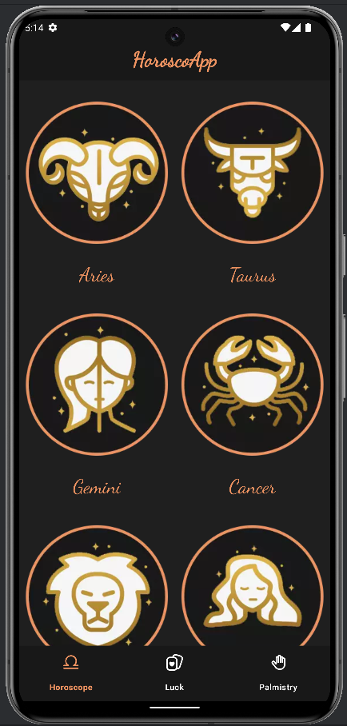
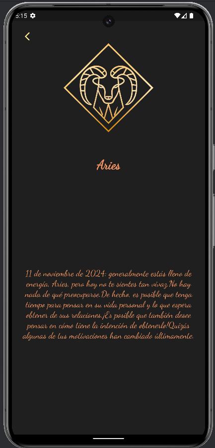
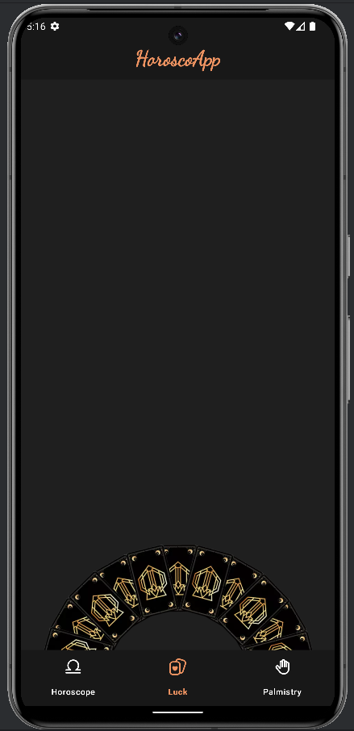
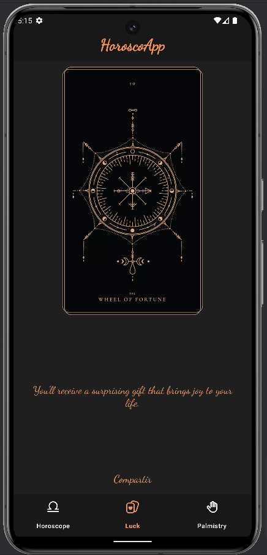
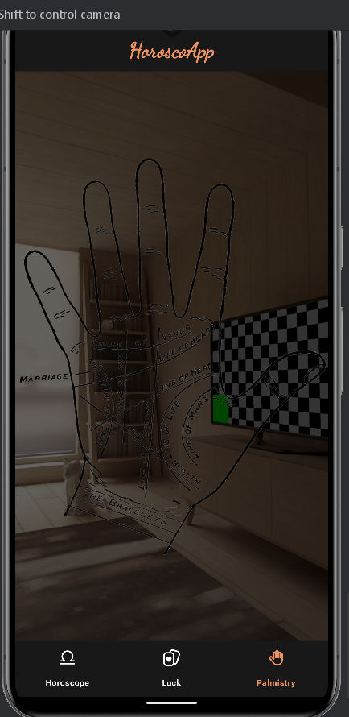

# ANDROID INTEMEDIO CON KOTLIN 

El temario:
 
- Arquitectura MVVM y clean code 
- Fragments
- Navigation Component
- Gradle KTS
- Inyección de dependencias
- StateFlow y corrutinas
- RecyclerView
- Retrofit, interceptors y mappers
- Intents
- Camera X
- Animaciones
- UnitTest y UITest
- ## APP 
     
    
     
     
    
    
     
     
    
   
